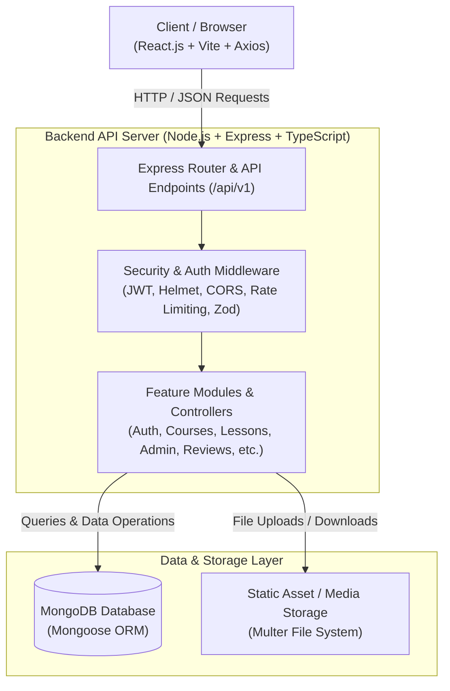

# Master New Skills With Expert Guidance LMS

A full-featured Learning Management System built with the **MERN Stack** (MongoDB, Express.js, React.js, Node.js). This platform supports three distinct user roles — **Admin**, **Instructor**, and **Student** — with complete role-based access control, course management, enrollment workflows, and progress tracking.

## Screenshots

Screenshots are in Separate Folder!

## Tech Stack

| Component        | Technologies                                                              |
| ---------------- | ------------------------------------------------------------------------- |
| **Frontend**     | React.js, React Router, Axios, CSS, Lucide Icons, Recharts, Framer Motion |
| **Backend**      | Node.js, Express.js                                                       |
| **Database**     | MongoDB, Mongoose                                                         |
| **Security**     | JWT Authentication, Bcrypt.js, Dotenv, Helmet, CORS                       |
| **File Uploads** | Multer                                                                    |
| **API Docs**     | Swagger (OpenAPI 3.0)                                                     |

## System Architecture



### Key Architectural Highlights
- **Layered Architecture**: Decoupled routes, controllers, middleware, and data models for clean separation of concerns.
- **RESTful API Specification**: Standardized `/api/v1` routes documented with Swagger / OpenAPI 3.0.
- **Modular Design**: Feature-based domain modules (Auth, Courses, Lessons, Enrollments, Admin) allowing seamless scalability.

## Features

### Student

- Register and login with email verification
- Browse and search published courses
- Enroll in free or paid courses
- Access course lessons and track progress
- View enrolled courses on a personal dashboard
- Leave reviews and ratings
- Download completion certificates (PDF)

### Instructor

- Create, edit, and delete courses
- Upload lessons with content and video support
- Create quizzes for lessons
- View analytics dashboard (enrollments, revenue, quiz performance)
- Publish/unpublish courses

### Admin

- View and manage all users
- Delete users (with cascading data cleanup)
- Ban/unban users
- Manage all courses and view system analytics
- Content moderation (discussions, replies)
- System health monitoring

## API Endpoints

### Authentication

| Method | Endpoint                      | Description                  |
| ------ | ----------------------------- | ---------------------------- |
| POST   | `/api/v1/auth/register`       | Register a new user          |
| POST   | `/api/v1/auth/login`          | Login and receive JWT tokens |
| POST   | `/api/v1/auth/logout`         | Logout (clear refresh token) |
| POST   | `/api/v1/auth/refresh`        | Refresh access token         |
| GET    | `/api/v1/auth/me`             | Get current user profile     |
| GET    | `/api/v1/auth/me/enrollments` | Get my enrolled courses      |
| GET    | `/api/v1/auth/me/dashboard`   | Get dashboard with progress  |

### Courses

| Method | Endpoint              | Description                            |
| ------ | --------------------- | -------------------------------------- |
| GET    | `/api/v1/courses`     | List all published courses             |
| GET    | `/api/v1/courses/:id` | Get single course details              |
| POST   | `/api/v1/courses`     | Create a new course (Instructor)       |
| PUT    | `/api/v1/courses/:id` | Update a course (Instructor)           |
| PATCH  | `/api/v1/courses/:id` | Partially update a course (Instructor) |
| DELETE | `/api/v1/courses/:id` | Delete a course (Instructor)           |

### Users (Admin)

| Method | Endpoint                       | Description      |
| ------ | ------------------------------ | ---------------- |
| GET    | `/api/v1/admin/users`          | View all users   |
| DELETE | `/api/v1/admin/users/:id`      | Delete a user    |
| PATCH  | `/api/v1/admin/users/:id/role` | Update user role |
| PATCH  | `/api/v1/admin/users/:id/ban`  | Ban/unban a user |

### Enrollment

| Method | Endpoint                      | Description             |
| ------ | ----------------------------- | ----------------------- |
| POST   | `/api/v1/enrollments`         | Enroll in a course      |
| GET    | `/api/v1/auth/me/enrollments` | Get my enrolled courses |

### Lessons

| Method | Endpoint                           | Description                  |
| ------ | ---------------------------------- | ---------------------------- |
| GET    | `/api/v1/lessons/course/:courseId` | Get lessons for a course     |
| POST   | `/api/v1/lessons`                  | Create a lesson (Instructor) |
| PATCH  | `/api/v1/lessons/:id`              | Update a lesson (Instructor) |
| DELETE | `/api/v1/lessons/:id`              | Delete a lesson (Instructor) |

## Database Models

### User

- `firstName`, `lastName`, `email`, `hashedPassword` (bcrypt), `role` (STUDENT/INSTRUCTOR/ADMIN)

### Course

- `title`, `description`, `instructorId` (ref: User), `category`, `price`, `isPublished`

### Enrollment

- `studentId` (ref: User), `courseId` (ref: Course), `status`, `purchasedAt`

## Project Structure

```
├── backend/                      # Backend source
│   ├── config/                   # Configuration (DB, env, logger, swagger)
│   ├── middleware/                # Auth, role-based access, validation, error handling
│   ├── models/                   # Mongoose schemas (User, Course, Enrollment, etc.)
│   ├── controllers/              # Controller index export
│   ├── routes/                   # Routes index export
│   ├── modules/                  # Feature modules (auth, courses, enrollments, etc.)
│   │   ├── auth/                 # Registration, login, JWT, password reset
│   │   ├── courses/              # CRUD, search, analytics
│   │   ├── enrollments/          # Enrollment, certificates
│   │   ├── lessons/              # Lesson CRUD, progress tracking
│   │   ├── admin/                # User management, stats, moderation
│   │   ├── reviews/              # Course reviews
│   │   ├── quizzes/              # Quiz creation and submission
│   │   ├── discussions/          # Lesson discussions
│   │   ├── payments/             # Stripe checkout
│   │   └── wishlist/             # Course wishlist
│   ├── utils/                    # AppError, catchAsync, email, file upload
│   ├── types/                    # TypeScript type declarations
│   ├── app.ts                    # Express app configuration
│   └── server.ts                 # Server entry point
├── frontend/                     # Frontend source (React + Vite)
│   └── src/
│       ├── components/           # Reusable UI components
│       ├── pages/                # Route pages
│       ├── services/             # API service layer (Axios)
│       ├── routes/               # Routing configurations
│       ├── context/              # Auth context provider
│       └── utils/                # API configuration
├── .env                          # Environment variables
├── .env.example                  # Environment template
└── package.json                  # Dependencies and scripts
```

## How to Start the Project

### Prerequisites

- **Node.js** (v18+)
- **MongoDB** (Local instance or MongoDB Atlas Cloud URI)

---

### Step 1: Install Dependencies

1. **Backend Dependencies** (Root folder):
   ```bash
   npm install
   ```

2. **Frontend Dependencies** (`frontend` folder):
   ```bash
   cd frontend
   npm install
   cd ..
   ```

---

### Step 2: Configure Environment Variables

Create or update `.env` in the root directory:

```env
NODE_ENV=development
PORT=5000
DATABASE_URL=mongodb://localhost:27017/lms_project
JWT_SECRET=supersecretplaceholder
CLIENT_URL=http://localhost:5173
```

*(Optional)* Seed the database with demo users:
```bash
npm run db:seed
```

---

### Step 3: Run the Application

The frontend and backend run as separate services. You can start them in separate terminal windows:

#### 1. Start the Backend API Server
Run in the **root directory**:
```bash
npm run dev
```
> Server will start at **`http://localhost:5000`**

#### 2. Start the Frontend Vite Development Server
Run in the **`frontend` directory**:
```bash
cd frontend
npm run dev
```
> App will start at **`http://localhost:5173`**

## Security

- **Password Hashing**: All passwords are hashed using **Bcrypt** with 12 salt rounds
- **JWT Authentication**: Access tokens (15-minute expiry) and HTTP-only refresh cookies (7-day expiry)
- **Role-Based Authorization**: Middleware-enforced role checks for Admin, Instructor, and Student routes
- **Input Validation**: Request body validation using **Zod** schemas
- **Rate Limiting**: API and auth-specific rate limiters
- **Helmet**: HTTP security headers
- **No hard-coded credentials**: All secrets stored in `.env` file

## Student Declaration

I declare that this project is my own original work, completed as part of the MERN Stack Web Development course final assessment.

**Date**: 31 May 2026  
**Signature**: Haider Rehman

Name: Haider Rehman
